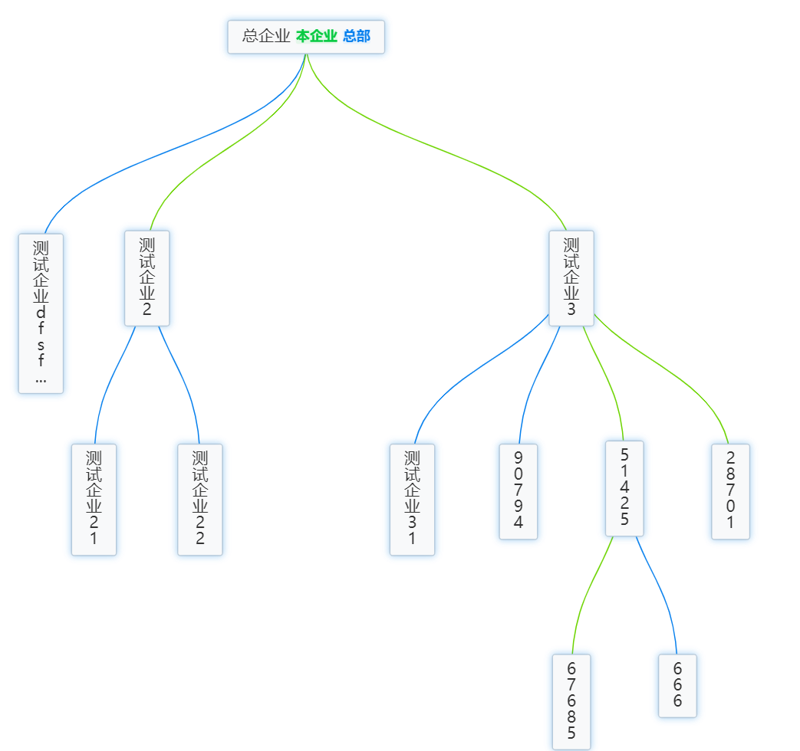
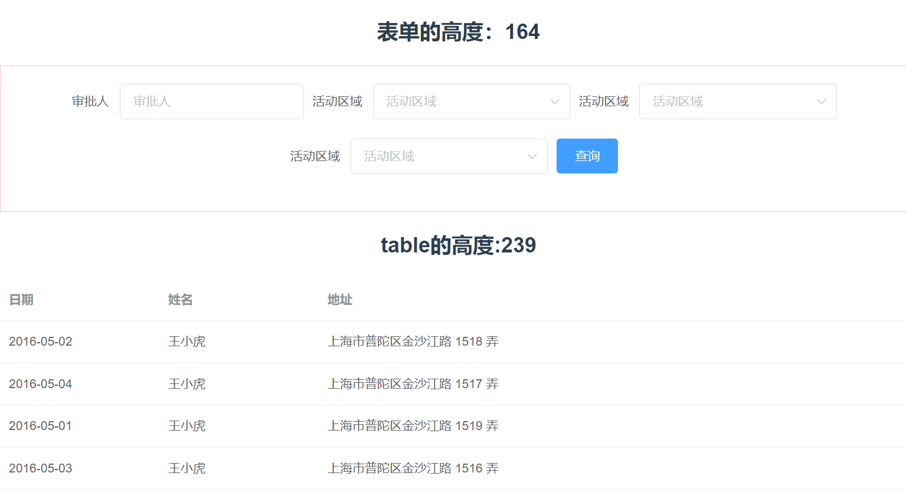

## 介绍

这个项目主要用来保存自己在开发中的使用记录,包含vue2 和vue3两个框架的一些功能需求的使用案例

### 1.vue2 案例功能说明

1. 目前已有echarts 树形图各个参数配置说明.配置最后的效果如下



echarts树形配置说明如下，仔细看，不要着急，终将有所收获

```js
 // 绘制企业结构的echarts
    renderTree(data) {
      this.childLength = [];
      this.Echarts = echarts.init(this.$refs["ent-tree"]);

      const options = {
        tooltip: {
          // 提示框浮层设置
          trigger: "item",
          triggerOn: "mousemove", // 提示框触发条件
        },
        series: [
          {
            type: "tree",
            data: [this.treeData],
            nodePadding: 30, //结点间距 （发现没用）
            layerPadding: 10, //连接线长度 （发现没用）
            name: "树图",
            top: "1%", // 组件离容器上侧的距离，像素值20，或相对容器的百分比20%
            left: "1%", // 组件离容器左侧的距离
            bottom: "1%", // 组件离容器下侧的距离
            right: "1%", // 组件离容器右侧的距离
            layout: "orthogonal", // 树图的布局，正交orthogonal和径向radial两种
            orient: "TB", // 树图中正交布局的方向，'LR','RL','TB','BT'，只有布局是正交时才生效
            edgeShape: "curve", // 树图边的形状，有曲线curve和折线polyline两种，只有正交布局下生效
            zoom: 0.8, //当前视角的缩放比例
            roam: true, //是否开启平游或缩放  // 是否开启鼠标缩放或平移，默认false
            scaleLimit: {
              //滚轮缩放的极限控制
              min: 0.2,
              max: 1,
            },
            initialTreeDepth: undefined, // 树图初始的展开层级（深度），根节点是0，不设置时全部展开
            symbol: "circle", // 标记的图形，默认是emptyCircle;circle,rect,roundRect,triangle,diamond,pin,arrow,none
            // symbolRotate: 270, // 配合arrow图形使用效果较好
            symbolSize: 6, // 大于0时是圆圈，等于0时不展示，标记的大小
            itemStyle: {
              // 树图中每个节点的样式
              color: "#0780ED", // 节点未展开时的填充色
              // borderWidth: 1, // 描边线宽，为0时无描边
              // borderType: 'dotted', // 描边类型
              borderCap: "round", // 指定线段末端的绘制方式butt方形结束，round圆形结束，square
              // shadowColor: 'rgba(0,121,221,0.3)', // 阴影颜色
              // shadowBlur: 16, // 图形阴影的模糊大小
              // opacity: 1 // 图形透明度
            },
            label: {
              // 每个节点对应的文本标签样式
              show: true, // 是否显示标签
              distance: 8, // 文本距离图形元素的距离
              position: ["50%", "50%"], // 标签位置
              verticalAlign: "middle", // 文字垂直对齐方式，默认自动，top，middle，bottom
              align: "center", // 文字水平对齐方式，默认自动，left，right，center
              fontSize: 16, // 字体大小
              color: "#333", // 字体颜色
              // color: 'red', // 字体颜色
              backgroundColor: "#F8F9FA", // 文字块的背景颜色
              borderColor: "#CED4DA", // 文字块边框颜色
              borderWidth: 1, // 文字块边框宽度
              borderType: "solid", // 文字块边框描边类型 solid dashed dotted
              borderRadius: 2, // 文字块的圆角
              padding: [6, 12], // 文字块内边距
              shadowColor: "rgba(0,121,221,0.3)", // 文字块的背景阴影颜色
              shadowBlur: 6, // 文字块的背景阴影长度
              // height: 130,
              // width: 12,
              // rotate: -90,
              // 文字超出宽度是否截断或者换行；只有配置width时有效
              // overflow: 'truncate', // truncate截断，并在末尾显示ellipsis配置的文本，默认为...;break换行;breakAll换行，并强制单词内换行
              // ellipsis: '...',
              formatter: (params) => {
                let newName = "";
                let len = params.data.name.length;
                let strLen = params.data.relationType === 0 ? 100 : 1; //一行显示几个字
                let rowNum = Math.ceil(len / strLen);
                if (len > strLen) {
                  for (let p = 0; p < rowNum; p++) {
                    let tempStr = "";
                    let start = p * strLen;
                    let end = start + strLen;
                    if (p == rowNum - 1) {
                      tempStr = params.data.name.substring(start, len);
                    } else {
                      tempStr = params.data.name.substring(start, end) + "\n";
                    }
                    newName += tempStr;
                  }
                } else {
                  newName = params.data.name;
                }
                let n = newName;
                if (n.length > 16) {
                  n = n.slice(0, 16) + "...";
                }
                let str = `{name|${n}}`;
                let isMain = params.data.relationType === 0;
                str = isMain ? `{name|${n}} {current|本企业} {main|总部}` : str;
                // console.log("str", str);
                return str;
              },
              rich: {
                name: {
                  fontSize: 14,
                },
                current: {
                  fontSize: 12,
                  padding: 0,
                  color: "#07CA42",
                  fontWeight: 600,
                  backgroundColor: "#E5F7EA",
                  borderRadius: 2,
                },
                main: {
                  color: "#0780ED",
                  fontSize: 12,
                  padding: 0,
                  fontWeight: 600,
                  backgroundColor: "#E6F2FD",
                  borderRadius: 2,
                },
              },
            },

            labelLayout: {
              dy: -20,
              verticalAlign: "top",
            },
            lineStyle: {
              // 树图边的样式
              // color: 'rgba(0,0,0,.35)', // 树图边的颜色
              width: 1, // 树图边的宽度
              // curveness: 1, // 树图边的曲度
              shadowColor: "rgba(0, 0, 0, 0.5)", // 阴影颜色
              // shadowBlur: 10 // 图形阴影的模糊大小
            },
            blur: {
              // 淡出状态的相关配置，开启emphasis.focus后有效
              itemStyle: {}, // 节点的样式
              lineStyle: {}, // 树图边的样式
              label: {}, // 淡出标签的文本样式
            },
            leaves: {
              // 叶子节点的特殊配置
              label: {
                // 叶子节点的文本标签样式
                distance: 0,
                position: "bottom",
                verticalAlign: "middle",
              },
              itemStyle: {}, // 叶子节点的样式
              emphasis: {}, // 叶子节点高亮状态的配置
              blur: {}, // 叶子节点淡出状态的配置
              select: {}, // 叶子节点选中状态的配置
            },
            animation: true, // 是否开启动画
            expandAndCollapse: true, // 子树折叠和展开的交互，默认打开
            animationDuration: 550, // 初始动画的时长
            animationEasing: "linear", // 初始动画的缓动效果
            animationDelay: 0, // 初始动画的延迟
            animationDurationUpdate: 750, // 数据更新动画的时长
            animationEasingUpdate: "cubicInOut", // 数据更新动画的缓动效果
            animationDelayUpdate: 0, // 数据更新动画的延迟
          },
        ],
      };

      /**
       * 遍历数节点
       */
      function nodesStutes(nodes) {
        if (nodes.childList && nodes.childList.length) {
          for (let i = 0; i < nodes.childList.length; i++) {
            if (nodes.childList[i].relationType === 2) {
              // 修改连线颜色
              nodes.childList[i].lineStyle = {
                color: "#6DD400",
              };
            } else if (nodes.childList[i].relationType === 1) {
              nodes.childList[i].lineStyle = {
                color: "#0780ED",
              };
            }
            nodesStutes(nodes.childList[i]);
          }
        }
      }

      nodesStutes(data);
      this.Echarts.setOption(options, true);
    },
```

2.前端记住密码案例

```js
  mounted() {
    this.getCookie();
  },
  methods: {
    // 页面挂载时，判断密码是否存在。
    getCookie() {
      this.loginForm.username = this.$cookie.get("username");
      if (this.$cookie.get("password")) {
        //解密
        this.loginForm.password = CryptoJS.AES.decrypt(
          this.$cookie.get("password"),
          "246521"
        ).toString(CryptoJS.enc.Utf8);
      } else {
        this.loginForm.username = "";
      }
    },
    // 点击登录时，保存账号密码，且对密码进行加密存储。
    handleLogin() {
      let code = 200;
      if (code == 200) {
        if (this.rememberPassword) {
          this.$cookie.set("username", this.loginForm.username, {
            expires: 3,
          }); //创建有效期为3天的cookie
          //  第二个参数为密钥，这里我设置为246521
          this.$cookie.set(
            "password",
            CryptoJS.AES.encrypt(this.loginForm.password, "246521"),
            { expires: 3 }
          );
        } else {
          this.$cookie.remove("username");
          this.$cookie.remove("password");
        }
        this.$router.push("/test");
      }
    },
  },
```

3. 生成二维码的使用记录，安装  ` npm install qrcodejs2，`  再进行配置生成二维码
4. 自定义指令动态获取元素的高度，效果如下：



自定义指令如下：

```js

 directives: {
    // 使用局部注册指令的方式
    resize: {
      // 指令的名称
      // 在指令绑定到元素时执行的钩子函数
      // el：绑定指令的元素
      // binding：包含指令信息的对象
      bind(el, binding) {
        // el为绑定的元素，binding为绑定给指令的对象
        let width = "",
          height = "";
        function isReize() {
          // Window.getComputedStyle()方法返回一个对象，该对象在应用活动样式表并解析这些值可能包含的任何基本计算后报告元素的所有 CSS 属性的值。
          //  检查元素的实际样式尺寸是否发生变化
          const style = document.defaultView.getComputedStyle(el);
          console.log("style", style.height);
          if (width !== style.width || height !== style.height) {
            // 如果尺寸变化，则执行绑定给指令的回调函数（binding.value()）
            binding.value(); // 关键
          }
          // 更新存储的当前尺寸信息
          width = style.width;
          height = style.height;
        }
        // 使用 setInterval 定期检查元素尺寸变化
        el.__vueSetInterval__ = setInterval(isReize, 500);
        console.log("el", el.__vueSetInterval__);
      },
      unbind(el) {
        // 在指令与元素解绑时执行的钩子函数
        // 清除之前设置的定时器，防止内存泄漏
        clearInterval(el.__vueSetInterval__);
      },
    },
  },
```
